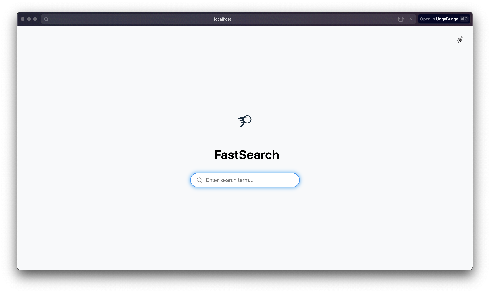
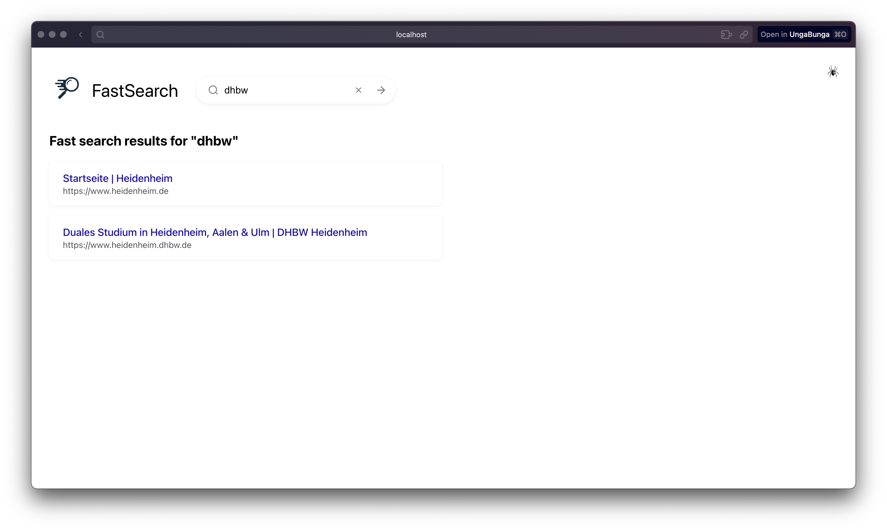
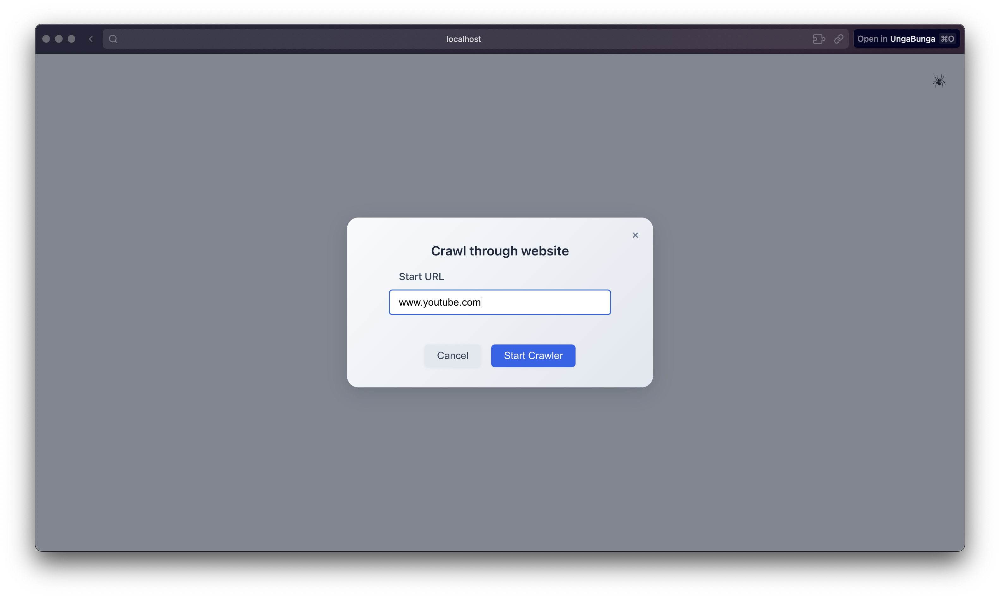
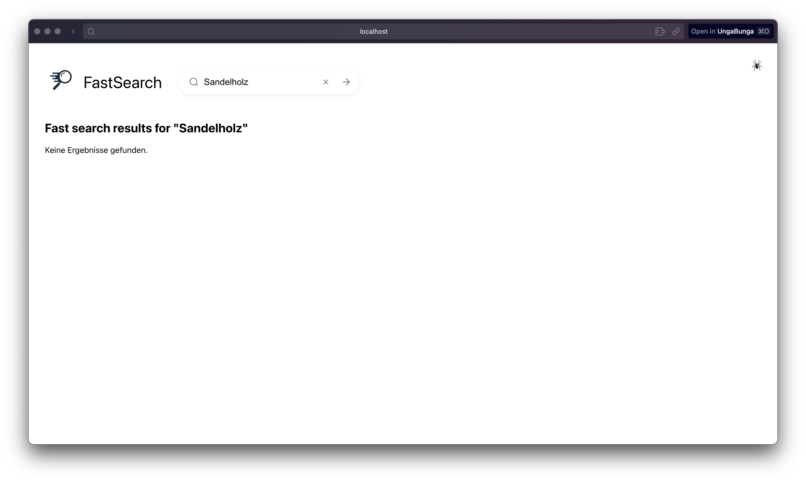
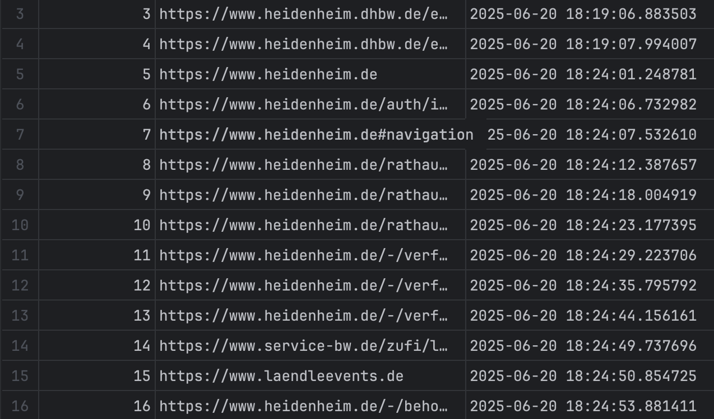
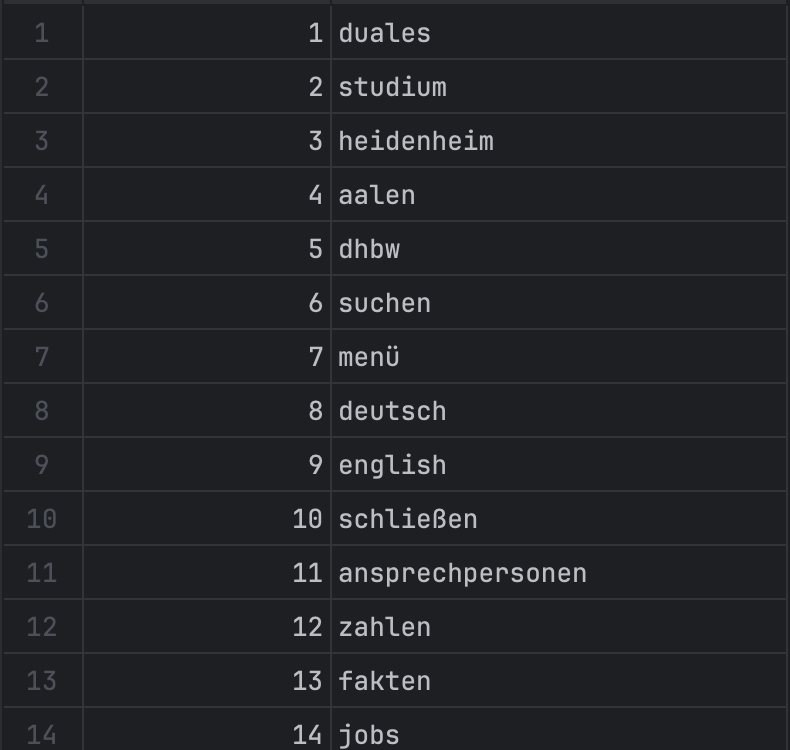
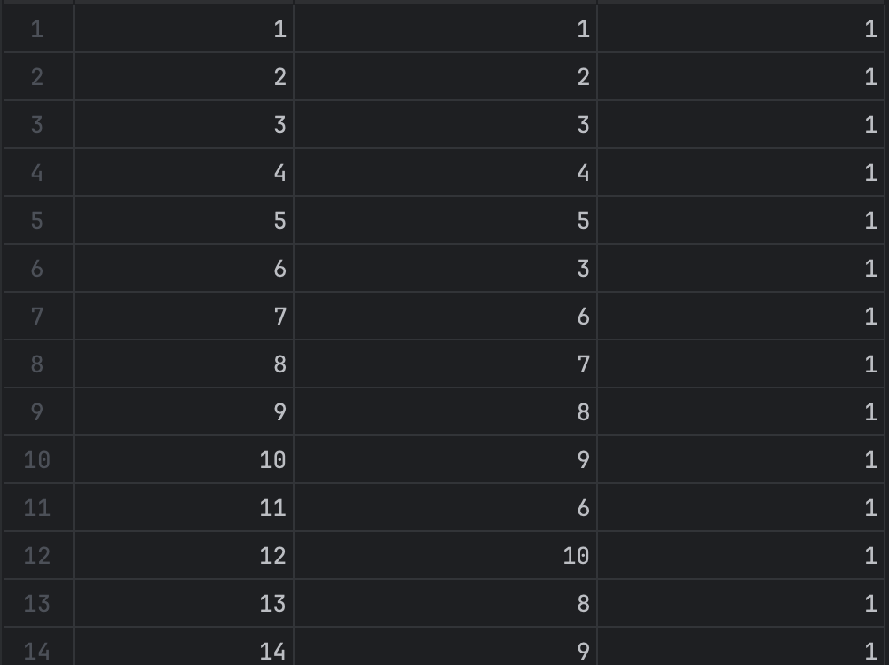

# Fast Search (Last Christmas)

## Dev Setup

### Backend

- create python venv with `python -m venv .venv` and activate it with: 
  - Unix: `source .venv/bin/activate`
  - Windoof: `.venv\Scripts\activate.bat`
- change directory to backend
- start db with `docker-compose -f docker-compose-dev up`
- run the `init.sql`file on the database
- install the python dependency's by running 'pip install -r requirements.txt'
- start the api by running `app.py`
- the crawler can be manually started by calling the endpoint `curl 127.0.0.1:5000/api/crawler/www.youtube.de`

### Frontend

- change directory to frontend
- check required installations with `node -v` and `npm -v`
- inside `frontend` folder run `npm install` to install project dependencies
- start react dev server by running `npm start`
- the frontend is running on localhost:3000

## API Endpoints

- '/api/search/<string:search_term>'
- '/api/crawler/<string:url>'

## Usage

After starting the front and backand searches can be executed by using the center searchbar.
To add urls to the crawler click the spider icon in the top right corner.

## Screenshots

### Website Frontend

